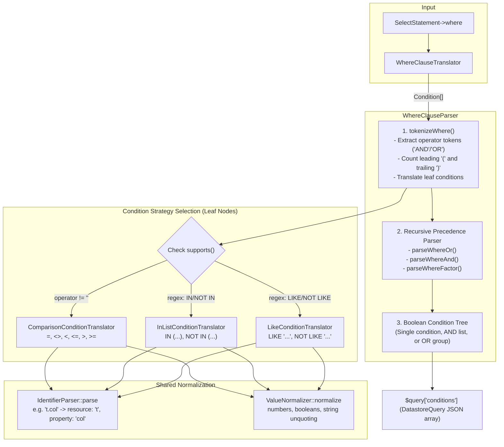
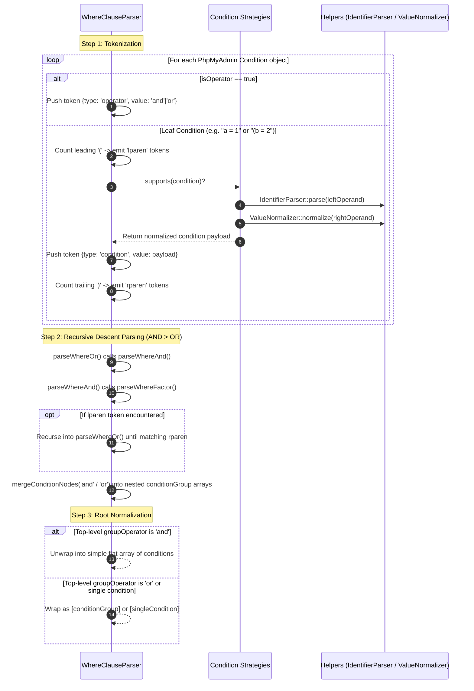

# WHERE Clause Condition Processing Flow

This document details the architectural flow, tokenization, precedence parsing, and strategy selection used in the `Condition` namespace (`SqlParserTest\Condition\*`).

---

## 1. High-Level Component & Strategy Flow

This diagram shows how `WhereClauseTranslator` delegates to `WhereClauseParser`, which selects registered `ConditionTranslatorInterface` strategies for leaf nodes and leverages shared normalization services.

---

## 2. Tokenization & Precedence Parsing Pipeline

This sequence diagram illustrates how a query with nested grouping and mixed operators (e.g., `WHERE a = 1 OR (b = 2 AND c LIKE "%x")`) is tokenized, parsed with standard boolean operator precedence (`AND` > `OR`), and merged into the final schema structure.

---

## Key Components

| Class | Responsibility |
|---|---|
| `WhereClauseTranslator` | Clause-level entry point called during top-level statement translation. |
| `WhereClauseParser` | Coordinates tokenization, parenthesis tracking, recursive precedence climbing, and AST assembly. |
| `ConditionTranslatorInterface` | Strategy interface for parsing leaf condition expressions. |
| `ComparisonConditionTranslator` | Handles binary comparison operators (`=`, `<>`, `<`, `<=`, `>`, `>=`). |
| `InListConditionTranslator` | Handles set membership operations (`IN (...)`, `NOT IN (...)`). |
| `LikeConditionTranslator` | Handles pattern-matching operations (`LIKE '...'`, `NOT LIKE '...'`). |
| `IdentifierParser` | Normalizes column/table references into resource and property strings. |
| `ValueNormalizer` | Coerces scalar values into native PHP types (int, float, bool, unquoted strings). |
